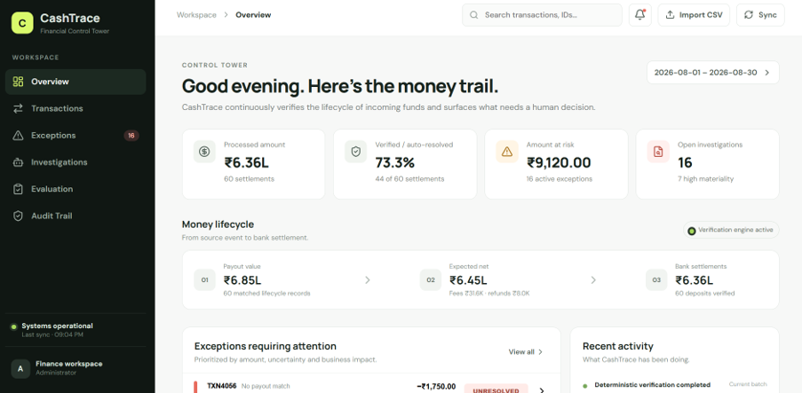
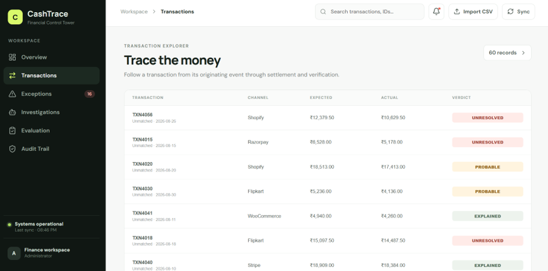
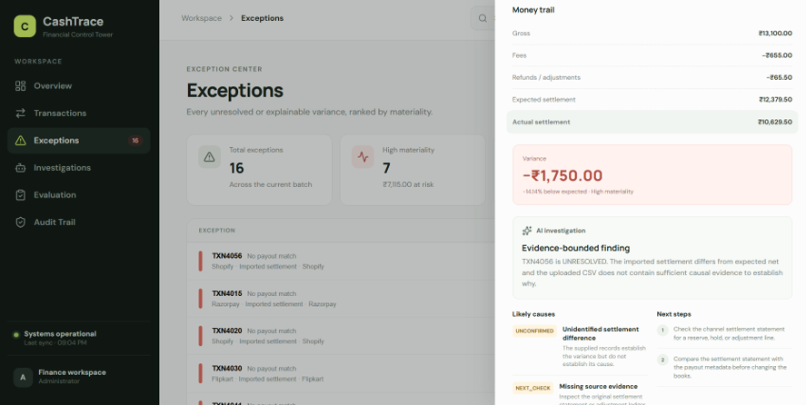

# CashTrace --- Financial Control Tower

> **Trace every rupee. Verify what can be proven. Investigate what
> doesn't. Prioritize what matters.**

**CashTrace is not another reconciliation tool.**

Traditional reconciliation asks:

> **"Do these two records match?"**

CashTrace asks:

> **"Can we explain the entire journey of this money --- and can we
> prove why the final settlement is what it is?"**



It turns fragmented financial records into a **verifiable money
lifecycle**, combining deterministic financial controls with AI-powered
investigation.

------------------------------------------------------------------------

## The idea

A financial transaction rarely exists as one clean record.

Money moves through a chain:

``` text
ORDER
  ↓
PAYMENT CAPTURED
  ↓
FEES / COMMISSIONS
  ↓
REFUNDS / ADJUSTMENTS
  ↓
EXPECTED SETTLEMENT
  ↓
ACTUAL BANK SETTLEMENT
  ↓
VARIANCE
  ↓
VERDICT
```

A conventional reconciliation system usually stops at:

``` text
Expected = Actual → Match
Expected ≠ Actual → Exception
```

CashTrace goes further.

It reconstructs the **financial lifecycle**, calculates what should have
settled, compares it with what actually settled, determines what can be
proven from the available evidence, and then uses AI to investigate
unresolved differences.

That creates a much more useful question for a finance operator:

> **"What happened to the money?"**

------------------------------------------------------------------------

# What makes CashTrace different?



### 1. From record matching → money lifecycle verification

CashTrace does not treat a payout and bank transaction as isolated rows.

For every settlement, it reconstructs:

-   gross payout value
-   processing fees
-   refunds / adjustments
-   expected net settlement
-   actual bank settlement
-   absolute variance
-   percentage variance

For example:

``` text
Payout                 ₹9,597.71
Fees                   ₹1,439.66
Refunds                  ₹189.17
                       ──────────
Expected settlement    ₹7,968.88

Actual bank settlement ₹7,186.13
                       ──────────
Variance                -₹782.75
Variance                  -9.8%
```

The system does not merely say **"mismatch."**

It says:

> **₹782.75 is missing from the expected settlement and requires
> investigation.**

------------------------------------------------------------------------

## 2. Proof-aware financial verdicts

One of the core ideas behind CashTrace is that **a plausible explanation
is not the same thing as proof**.

Every result is therefore assigned a proof-aware verdict:

  -----------------------------------------------------------------------
  Verdict                             Meaning
  ----------------------------------- -----------------------------------
  **VERIFIED**                        Deterministic evidence confirms the
                                      financial lifecycle

  **EXPLAINED**                       A mismatch has sufficient
                                      evidence-backed explanation

  **PROBABLE**                        A likely explanation exists, but
                                      the available records do not prove
                                      it

  **UNRESOLVED**                      There is insufficient evidence and
                                      human review is required
  -----------------------------------------------------------------------

This prevents an AI system from turning a guess into a financial fact.

For example, the current dataset contains settlement shortfalls that
look consistent with a reserve/hold.

CashTrace deliberately reports them as:

``` text
PROBABLE
```

rather than pretending the source data proves a reserve occurred.

That distinction is fundamental to financial AI.

------------------------------------------------------------------------

# AI investigates. Deterministic code verifies.

CashTrace uses AI where reasoning is useful --- and deterministic
computation where correctness matters.

``` text
                 ┌─────────────────────────┐
                 │     Financial Records    │
                 │ payouts / bank / ledger  │
                 └────────────┬────────────┘
                              ↓
                 ┌─────────────────────────┐
                 │ Deterministic Financial │
                 │       Engine             │
                 │                         │
                 │ matching                │
                 │ fee/refund arithmetic   │
                 │ expected settlement     │
                 │ variance                │
                 │ materiality             │
                 └────────────┬────────────┘
                              ↓
                 ┌─────────────────────────┐
                 │    Proof-aware Verdict  │
                 │                         │
                 │ VERIFIED / PROBABLE /   │
                 │ UNRESOLVED              │
                 └────────────┬────────────┘
                              ↓
                 ┌─────────────────────────┐
                 │      AI Investigator    │
                 │                         │
                 │ explains anomalies      │
                 │ ranks possible causes   │
                 │ recommends next checks │
                 └────────────┬────────────┘
                              ↓
                 ┌─────────────────────────┐
                 │      Audit Trail        │
                 │                         │
                 │ evidence → finding →    │
                 │ action                  │
                 └─────────────────────────┘
```

### Why this architecture?

LLMs are excellent at:

-   interpreting financial context
-   connecting evidence
-   generating investigation hypotheses
-   explaining anomalies
-   recommending next actions

LLMs should **not** be trusted to:

-   perform financial arithmetic
-   silently change transaction amounts
-   decide that an exception is resolved without evidence
-   invent missing financial records

CashTrace therefore enforces a hard boundary:

> **The model can investigate the numbers. It cannot rewrite the
> numbers.**

------------------------------------------------------------------------

# AI Investigation

When an exception is selected, CashTrace sends the **deterministically
computed facts** to the configured LLM.



The model is instructed to:

-   preserve all financial values
-   distinguish evidence from hypotheses
-   never upgrade a PROBABLE or UNRESOLVED case into VERIFIED without
    evidence
-   identify likely causes
-   recommend the next evidence to inspect

If no model key is configured, CashTrace falls back to a deterministic
explanation and explicitly labels it as a fallback.

This makes the system usable during development while keeping the AI
boundary transparent.

------------------------------------------------------------------------

# Materiality: not every exception deserves equal attention

A finance team should not receive a flat list of hundreds of mismatches.

CashTrace prioritizes exceptions using:

-   absolute variance
-   percentage variance
-   materiality

The result is an investigation queue ordered by **financial
importance**, not simply by database order.

This turns reconciliation from a reporting task into a **financial
control workflow**.

------------------------------------------------------------------------

# Current evaluation

The included synthetic dataset contains:

-   **192** bank-feed transactions
-   **37** settlement deposits examined
-   **33** deterministic exact matches
-   **4** partial/short settlements
-   **89.2%** automatically verified
-   **₹1,780.73** total settlement variance identified

The current reconciliation engine therefore produces a concrete
exception list rather than hiding mismatches behind a single accuracy
number.

### Categorization evaluation

The repository also includes a held-out categorization evaluation:

-   **69** held-out transactions
-   **94.2%** baseline categorization accuracy
-   **100%** with the example-memory RAG path
-   **+5.8 percentage-point lift**

The evaluation scripts are included in the repository so the system can
be tested rather than judged purely from the UI.

> These are results on the included synthetic dataset, not a claim of
> production-scale performance.

------------------------------------------------------------------------

# Architecture

``` text
                    ┌───────────────────┐
                    │   CSV / Financial │
                    │       Data        │
                    └─────────┬─────────┘
                              │
                              ↓
                    ┌───────────────────┐
                    │ Data + Schemas    │
                    │ generate_data.py  │
                    └─────────┬─────────┘
                              │
                ┌─────────────┴─────────────┐
                ↓                           ↓
       ┌────────────────┐          ┌────────────────┐
       │ Categorization │          │ Reconciliation │
       │ + RAG memory   │          │ deterministic  │
       └───────┬────────┘          └───────┬────────┘
               │                           │
               └─────────────┬─────────────┘
                             ↓
                   ┌────────────────────┐
                   │ CashTrace API      │
                   │ cashtrace_api.py   │
                   └─────────┬──────────┘
                             │
              ┌──────────────┼──────────────┐
              ↓              ↓              ↓
        ┌──────────┐   ┌───────────┐  ┌───────────┐
        │ Overview │   │ Exceptions│  │Audit Trail│
        └──────────┘   └─────┬─────┘  └───────────┘
                             ↓
                      ┌──────────────┐
                      │ AI Investigator│
                      └──────────────┘
                             ↓
                      ┌──────────────┐
                      │ Evidence +   │
                      │ Next Actions │
                      └──────────────┘
```

------------------------------------------------------------------------

# Tech Stack

### Backend

-   Python
-   deterministic reconciliation engine
-   rule-based financial calculations
-   RAG / knowledge-base retrieval
-   OpenAI-compatible LLM interface
-   standard-library HTTP API

### Frontend

-   React
-   Vite
-   CSS
-   responsive finance control-tower UI

### Data

-   CSV-based financial records
-   synthetic settlement data
-   reconciliation evaluation data
-   accounting knowledge base

------------------------------------------------------------------------

# Project Structure

``` text
financial-reconciliation-agent/
│
├── data/
│   ├── bank_feed.csv
│   ├── payouts.csv
│   ├── ...
│
├── src/
│   ├── agent.py
│   ├── categorize.py
│   ├── cashtrace_api.py
│   ├── evaluate.py
│   ├── evaluate_kb.py
│   ├── generate_data.py
│   ├── knowledge_base.py
│   ├── ledger.py
│   ├── model.py
│   ├── policy_rag.py
│   ├── reconcile.py
│   └── schema.py
│
└── README.md
```

------------------------------------------------------------------------

# Running the project

## 1. Install dependencies

Create a Python environment and install the project's dependencies.

``` bash
pip install -r requirements.txt
```

If the repository is being run through its existing Poetry
configuration:

``` bash
poetry install
```

------------------------------------------------------------------------

## 2. Run the reconciliation engine

Run the existing reconciliation workflow:

``` bash
python -m src.reconcile
```

This processes the supplied financial data and produces the
deterministic reconciliation results.

------------------------------------------------------------------------

## 3. Start the CashTrace API

``` bash
python -m src.cashtrace_api
```

The API exposes:

``` text
GET /api/health
GET /api/overview
GET /api/exceptions
GET /api/transactions
GET /api/transactions/<txn_id>
GET /api/investigations/<txn_id>
GET /api/evaluation
GET /api/audit
```

------------------------------------------------------------------------

## 4. Run the frontend

From the frontend directory:

``` bash
npm install
npm run dev
```

The frontend communicates with the CashTrace API to display:

-   financial overview
-   settlement lifecycle
-   exceptions
-   transaction evidence
-   AI investigations
-   evaluation results
-   audit history

------------------------------------------------------------------------

# Using your own financial data

CashTrace is designed around structured financial records rather than
the values in the demo dataset.

The reconciliation logic is **data-driven**.

To use another dataset, provide records matching the expected schema for
the corresponding data source, such as:

-   transaction ID
-   date
-   channel
-   payout ID
-   gross amount
-   fees
-   refunds / adjustments
-   expected settlement
-   bank settlement amount

The financial calculations are then recomputed from the supplied
records.

The demo values are not embedded into the reconciliation calculations.

Some policies --- such as matching tolerance, time window, severity
thresholds and reserve/hold interpretation --- are explicit
configuration/rules and can be changed independently of the financial
data.

------------------------------------------------------------------------

# Why this matters for fintech

Financial operations teams do not just need to know that two ledgers
disagree.

They need to know:

1.  **How much money is affected?**
2.  **Where in the lifecycle did it diverge?**
3.  **What evidence supports the conclusion?**
4.  **What is proven versus merely likely?**
5.  **What should an operator investigate next?**
6.  **Which exceptions actually matter financially?**

CashTrace turns those questions into one workflow.

------------------------------------------------------------------------

# Design principles

### Financial correctness first

All monetary calculations are deterministic.

### Evidence over confidence

A confident model response is not evidence.

### Explain uncertainty

If the available records cannot prove a cause, CashTrace says so.

### Human review is a feature

`UNRESOLVED` is an intentional outcome, not a system failure.

### AI as investigator, not accountant

The model interprets evidence. It does not become the source of truth.

### Auditability

Every result can be traced back to the financial records and
deterministic calculations that produced it.

------------------------------------------------------------------------

# The bigger idea

CashTrace can evolve beyond settlement reconciliation into a broader
**financial control layer**.

The same architecture can be applied to:

``` text
Payment captured
      ↓
Fee applied
      ↓
Refund issued
      ↓
Settlement expected
      ↓
Settlement received
      ↓
Ledger updated
      ↓
Bank confirmed
      ↓
Control verified
```

Instead of asking software to simply reconcile two files, CashTrace
moves toward a system that can continuously answer:

> **"Can every movement of money be accounted for, explained, and
> proven?"**

That is the problem CashTrace is built to solve.

------------------------------------------------------------------------

## One-line pitch

**CashTrace is an AI-powered financial control tower that reconstructs
the lifecycle of money, deterministically verifies what can be proven,
and investigates what cannot.**
